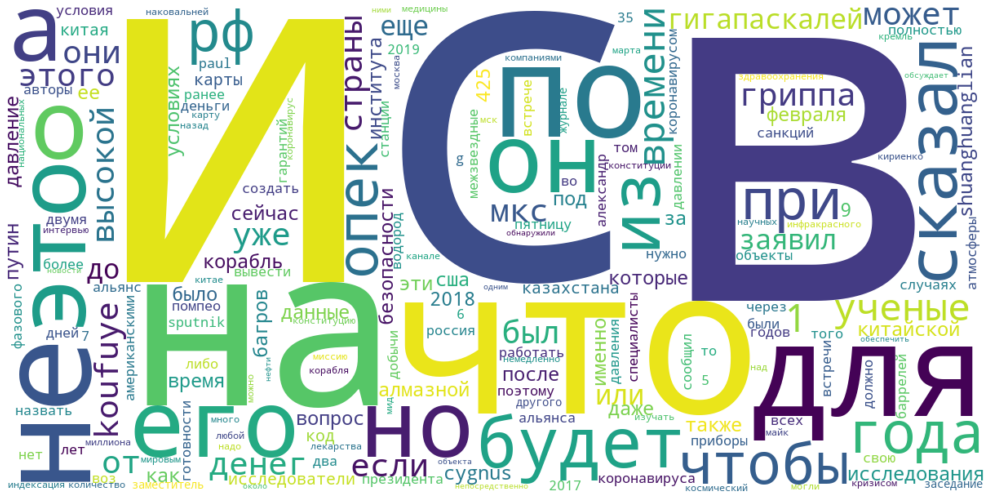
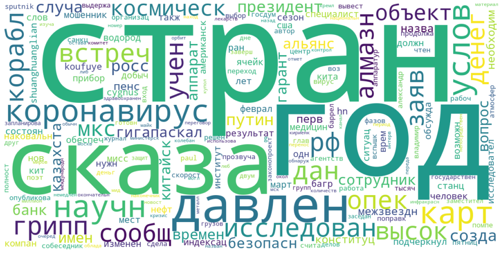
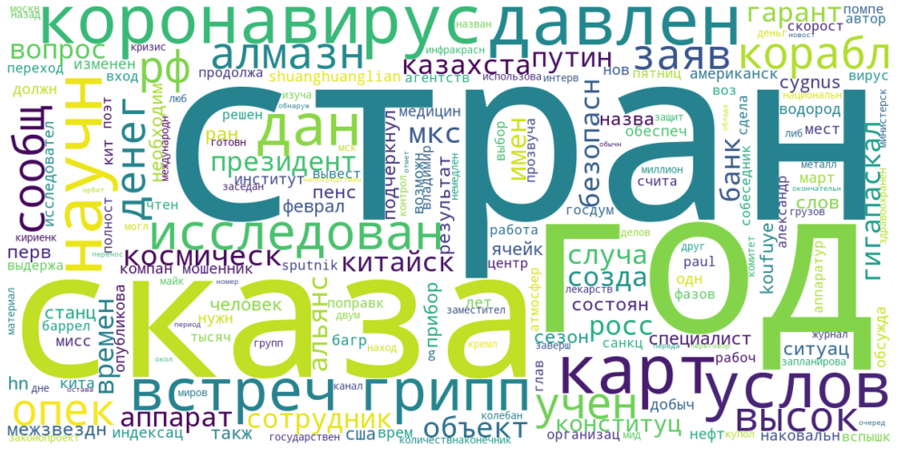

<h1><center>Частотный анализ текста, построение облака слов</center></h1>


```python
import numpy as np 
import re 
from sklearn.feature_extraction.text import CountVectorizer
import matplotlib.pyplot as plt  
from wordcloud import WordCloud 

import nltk 
nltk.download('stopwords') 
from nltk.corpus import stopwords 
stop_words = stopwords.words("russian") 
from nltk.stem.snowball import RussianStemmer 
Stemmer_rus = RussianStemmer()
```

    [nltk_data] Downloading package stopwords to
    [nltk_data]     C:\Users\ZuZu\AppData\Roaming\nltk_data...
    [nltk_data]   Package stopwords is already up-to-date!
    

### Название файла


```python
file_name = 'rus-news.txt'
```

### Считывание набора текстов из файла (каждый текст - в отдельной строке файла)

Файл должен находится в текущей рабочей папке


```python
with open(file_name, encoding='utf-8') as file:
    texts = file.readlines()
```

### Просмотр 1-го текста в списке


```python
texts[0]
```


    'Даже в условиях санкций Россия смогла справиться с мировым финансовым кризисом и создать подушку безопасности для обеспечения социальных гарантий по пенсиям, заявил первый заместитель руководителя администрации президента России Сергей Кириенко, отвечая на вопрос о смысле изменения Конституции РФ. Главное, по его словам, это вопрос социальных гарантий, в частности индексация пенсии. "Никакое правительство не может сказать: знаете, у нас сейчас нет денег, ну раньше это (индексация пенсий – ред.) было, а теперь давайте это такое-то время не будет, а появятся деньги — будет опять. Вот это долгосрочная гарантия, что все обязательства будут всегда", - сказал Кириенко в интервью программе "Москва. Кремль. Путин" на канале "Россия 1". Он подчеркнул, что слова президента РФ Владимира Путина об обязательной ежегодной индексации пенсий, ещё пять лет назад не могли прозвучать. "Это то, о чем президент сказал в своем послании. Он сказал, что значимое количество времени потрачено на то, чтобы создать условия. Именно поэтому эти слова президента прозвучали сейчас, именно поэтому они не могли прозвучать пять лет назад. Это значит, что страна справилась с мировым финансовым кризисом и его последствиями для страны и даже в условиях санкций создала необходимые условия и подушку безопасности для того, чтобы обеспечить гарантии для людей, не ставя под риски финансово-экономическую систему", - сказал он. Президент РФ Владимир Путин внес в Госдуму законопроект о поправке в конституцию, Госдума поддержала его в первом чтении. Поправки направлены на развитие положений, закрепляющих основы конституционного строя, права и свободы человека и гражданина. Рабочая группа по работе над изменениями в конституции планирует работать над поправками ко второму чтению законопроекта. Сопредседатели рабочей группы заявляли, что предложения о внесении изменений в Конституцию РФ, с которым Путин выступил в ходе послания Федеральному собранию, были четко сформулированы и уже находились в высокой степени готовности.\n'


## Строим облако слов без предобработки и очистки текстов

### Построение ДТМ


```python
vectorizer = CountVectorizer(min_df=1, token_pattern = r"(?u)\b\w+\b") # преобразование набора документов в матрицу ДТ
# по умолчанию token_pattern = r”(?u)\b\w\w+\b”. Слова из одного символа будут пропущены 
tdm = vectorizer.fit_transform(texts) # настройка и получение матрицы «документ-терм»
```


```python
tdm # информация о ДТМ (размерность и количество хранимых элементов)
```


    <10x1151 sparse matrix of type '<class 'numpy.int64'>'
    	with 1421 stored elements in Compressed Sparse Row format>


```python
print(len(vectorizer.get_feature_names())) # кол-во термов в ДТМ
print(vectorizer.get_feature_names()) # полный список термов
```

    1151
    ['1', '10', '100', '12', '15', '17', '171', '186', '1997', '2', '20', '2003', '2012', '2013', '2017', '2018', '2019', '2020', '213', '28', '31', '35', '4', '425', '5', '50', '6', '600', '7', '7729', '9', 'aec', 'cvv', 'cygnus', 'dumas', 'environmental', 'florent', 'g', 'grumman', 'h1n1', 'h5n1', 'h7n9', 'huoxiangzhengqi', 'koufuye', 'letters', 'loubeyre', 'nature', 'ncov', 'northrop', 'occelli', 'paul', 'research', 'shuanghuanglian', 'soleil', 'sputnik', 'wu', 'zhaohua', 'а', 'автоматических', 'авторы', 'агентства', 'агентство', 'администрации', 'академии', 'активность', 'александр', 'алмазного', 'алмазной', 'алмазными', 'алмазом', 'альянс', 'альянса', 'американские', 'американскими', 'анализ', 'анализировали', 'антибактериальными', 'аппарат', 'аппарата', 'аппаратов', 'аппаратура', 'аппаратуры', 'аппараты', 'аравия', 'атипичной', 'атмосферы', 'атомной', 'багров', 'багрова', 'байкальский', 'банка', 'банки', 'банков', 'банковский', 'банком', 'банкоматами', 'баррелей', 'бдительность', 'безопасное', 'безопасности', 'белоруссию', 'беспокойство', 'беспрепятственно', 'благоприятным', 'ближайших', 'ближневосточным', 'более', 'болезни', 'бороться', 'борьбе', 'британские', 'будет', 'будут', 'бы', 'был', 'были', 'было', 'быть', 'в', 'вакуума', 'ведущий', 'вене', 'верхних', 'вещества', 'виртуальную', 'вируса', 'вирусов', 'вирусологии', 'включены', 'владимир', 'владимира', 'власти', 'влияние', 'вне', 'внес', 'внесении', 'внимание', 'во', 'водород', 'водорода', 'воз', 'возбудителя', 'воздуха', 'возможной', 'возможность', 'возможным', 'возникновения', 'вопрос', 'вопросы', 'вот', 'врезаются', 'времени', 'время', 'все', 'всегда', 'всего', 'всемирную', 'всех', 'вспышке', 'вспышку', 'встретится', 'встреч', 'встречами', 'встрече', 'встречи', 'вступать', 'всю', 'вторник', 'второму', 'ву', 'входа', 'входит', 'входящих', 'вы', 'выбора', 'выборе', 'вывести', 'выгодно', 'выделяется', 'выдержала', 'выдержали', 'выдерживать', 'выездной', 'выпустить', 'высоких', 'высокой', 'выступил', 'выявлены', 'выяснили', 'газетой', 'газовых', 'гарантии', 'гарантий', 'гарантия', 'гигантов', 'гигантское', 'гигапаскалей', 'глава', 'главное', 'главой', 'глобальное', 'года', 'годов', 'году', 'городе', 'госдеп', 'госдума', 'госдуму', 'госсекретарь', 'гостя', 'государственное', 'государственный', 'готовности', 'граждане', 'гражданина', 'гриппа', 'гриппу', 'груза', 'грузовой', 'грузовую', 'группа', 'группы', 'густонаселенных', 'давайте', 'давление', 'давлении', 'давления', 'давлениях', 'давно', 'даже', 'дали', 'дальнейшая', 'дальше', 'данные', 'данный', 'данными', 'данных', 'дают', 'два', 'двигатели', 'движутся', 'двумя', 'действует', 'декабря', 'делам', 'деловые', 'деловых', 'денег', 'деньги', 'десятки', 'детей', 'деформируется', 'дизайн', 'для', 'дней', 'до', 'добычи', 'добычу', 'догнать', 'договоренность', 'доказательства', 'долгосрочная', 'должна', 'должно', 'должность', 'доставке', 'достичь', 'другого', 'дюма', 'его', 'ее', 'ежегодной', 'если', 'еще', 'ещё', 'жар', 'же', 'жертвами', 'жимолость', 'журнале', 'за', 'забайкальском', 'заблокирован', 'заболеваемости', 'заболевших', 'заболели', 'завершив', 'завершить', 'завести', 'заключается', 'законопроект', 'законопроекта', 'закрепляющих', 'заливать', 'залить', 'заместитель', 'замечена', 'запланирован', 'запланировано', 'запуска', 'заражены', 'заседание', 'защите', 'защитить', 'защиты', 'заявив', 'заявил', 'заявление', 'заявляли', 'звонок', 'звонящий', 'здравоохранения', 'земли', 'зима', 'знаете', 'знакомый', 'значения', 'значимое', 'значит', 'и', 'идею', 'идти', 'из', 'избежания', 'избежать', 'известно', 'изменений', 'изменения', 'изменениями', 'изменили', 'изначально', 'изнутри', 'изотопный', 'изучать', 'или', 'имеет', 'имени', 'именно', 'имеющих', 'иммунную', 'имя', 'индексации', 'индексация', 'института', 'интервью', 'интересно', 'интернете', 'информация', 'инфракрасного', 'испарить', 'использовали', 'использовать', 'используется', 'испытания', 'исследований', 'исследования', 'исследованиям', 'исследователи', 'исторические', 'историю', 'источник', 'италии', 'итогам', 'их', 'к', 'кабинет', 'казахстан', 'казахстана', 'казахстанской', 'как', 'какие', 'какими', 'какое', 'какой', 'канале', 'карте', 'картина', 'картой', 'карту', 'карты', 'квартале', 'километров', 'кириенко', 'китае', 'китайские', 'китайской', 'китаю', 'китая', 'клиента', 'клинические', 'ко', 'код', 'колебания', 'колебаниях', 'количество', 'комиссии', 'комитет', 'комитета', 'компании', 'компаниями', 'конец', 'конечно', 'конституции', 'конституционного', 'конституцию', 'конструкция', 'контрактов', 'контролю', 'контроля', 'конца', 'корабль', 'корабля', 'королёвских', 'коронавирус', 'коронавируса', 'коронавирусом', 'космический', 'космических', 'космического', 'космической', 'которого', 'которое', 'котором', 'которые', 'который', 'которым', 'крае', 'кражу', 'крайне', 'кредитной', 'кремль', 'крепким', 'кризисом', 'криогенным', 'кристаллическую', 'купол', 'куполом', 'лавочкина', 'легко', 'лед', 'лекарства', 'лекарство', 'лет', 'либо', 'лица', 'личный', 'ломается', 'лубейр', 'луч', 'лучше', 'лучший', 'льдом', 'любой', 'людей', 'майк', 'максимум', 'малых', 'манипулятор', 'марат', 'марта', 'марте', 'материалом', 'материалы', 'медицине', 'медицины', 'между', 'международного', 'международной', 'межзвездного', 'межзвездные', 'менее', 'менялись', 'места', 'местах', 'местному', 'место', 'месяцы', 'металл', 'металлическое', 'металлом', 'механический', 'мид', 'миллиона', 'министерскими', 'министерских', 'министр', 'мировым', 'миссию', 'миссия', 'мкс', 'многие', 'много', 'мобильное', 'могли', 'может', 'можно', 'момент', 'мониторингового', 'москва', 'мошенник', 'мошенники', 'мошенников', 'мошенничества', 'мск', 'мухтаром', 'мы', 'мягкой', 'на', 'наблюдений', 'наборов', 'нагнетать', 'над', 'надавить', 'надо', 'назад', 'название', 'названием', 'названо', 'назвать', 'назначены', 'наиболее', 'наковальней', 'наковальни', 'наконечника', 'наконечниками', 'намечена', 'напомнил', 'направленный', 'направлены', 'нас', 'наса', 'настолько', 'насторожиться', 'наук', 'научная', 'научного', 'научной', 'научные', 'научный', 'научных', 'нафталином', 'находились', 'находится', 'национальных', 'начала', 'наши', 'не', 'недавнего', 'нее', 'незначительно', 'неизвестной', 'некоторое', 'немедленно', 'необходимо', 'необходимое', 'необходимую', 'необходимые', 'неоднократно', 'непосредственно', 'нескольких', 'нет', 'нефти', 'нефтью', 'никакое', 'никогда', 'ними', 'них', 'но', 'новак', 'нового', 'новое', 'новости', 'новый', 'номер', 'номеру', 'ноябре', 'нпо', 'ну', 'нужно', 'о', 'об', 'оба', 'обезопасить', 'обеспечения', 'обеспечит', 'обеспечить', 'обладает', 'обладают', 'области', 'обнаружили', 'обоих', 'обойти', 'образец', 'обращают', 'обсудили', 'обсуждает', 'обсуждать', 'объекта', 'объекты', 'обычном', 'обычные', 'обязательной', 'обязательства', 'одним', 'одного', 'океана', 'около', 'окончательного', 'октября', 'он', 'они', 'оно', 'опек', 'определена', 'опубликовали', 'опубликованы', 'опять', 'орбите', 'орбиту', 'орбиты', 'организации', 'организацию', 'организма', 'осенние', 'основы', 'оставался', 'оставаться', 'острым', 'от', 'отверстие', 'отвести', 'отвечая', 'отдельную', 'отметил', 'отношения', 'отошел', 'отпустил', 'отработанные', 'отражен', 'отстыковался', 'официально', 'оценить', 'очевидный', 'очень', 'очередь', 'очистить', 'оччелли', 'параллельно', 'пароль', 'партнеров', 'партнерство', 'пенетраторы', 'пенсии', 'пенсий', 'пенсиям', 'первом', 'первоначальных', 'первый', 'первых', 'переводить', 'переговоров', 'перед', 'передает', 'перенос', 'перехватить', 'перехода', 'переходит', 'период', 'пин', 'планами', 'планет', 'планируемой', 'планирует', 'планируется', 'планов', 'пневмонией', 'пневмонии', 'по', 'поверхность', 'поверхностью', 'повислая', 'повышает', 'погоды', 'под', 'поддержала', 'поддерживаем', 'поддерживают', 'поддержку', 'подогрев', 'подозрительная', 'подразделения', 'подтвердил', 'подушку', 'подчеркнул', 'подчеркнули', 'позже', 'позитивно', 'пока', 'показал', 'показывают', 'покинули', 'покупкой', 'покупок', 'пол', 'полированными', 'политики', 'полностью', 'положений', 'полом', 'получили', 'полушария', 'помещается', 'помогают', 'помониторить', 'помощью', 'помпео', 'пончика', 'попадают', 'попасть', 'поправками', 'поправке', 'поправки', 'попросит', 'попросить', 'попытаются', 'посадки', 'послании', 'послания', 'после', 'последнего', 'последствиями', 'посмотрите', 'потепление', 'потеря', 'потрачено', 'почти', 'поэтому', 'появилась', 'появятся', 'пояснили', 'права', 'правительства', 'правительство', 'предел', 'предложения', 'предложил', 'предложили', 'предотвратить', 'предполагали', 'предположили', 'председателя', 'представился', 'предусматривала', 'предыдущие', 'предыдущий', 'президент', 'президента', 'препарата', 'при', 'приборов', 'приборы', 'приземление', 'приземного', 'признала', 'приложение', 'принадлежащего', 'принять', 'пристыкован', 'причем', 'проанализировали', 'проанализировать', 'проблема', 'проведения', 'провели', 'провести', 'проводили', 'проводятся', 'прогнозирования', 'программе', 'продлевалось', 'продолжает', 'продолжали', 'проектах', 'проектов', 'прозвучали', 'прозвучать', 'прозрачность', 'проинформировали', 'проникают', 'просит', 'просто', 'против', 'противовирусный', 'противовирусными', 'проходит', 'проходящий', 'прочным', 'проявить', 'прямой', 'псевдобанка', 'путин', 'путина', 'путями', 'пытается', 'пытаются', 'пятницу', 'пять', 'работать', 'работе', 'рабочая', 'рабочей', 'рабочие', 'радио', 'развитие', 'разговоре', 'разработан', 'разработчик', 'разработчики', 'разрушатся', 'районов', 'ранее', 'ранний', 'раньше', 'расположенном', 'распространения', 'расстояние', 'рассчитан', 'расчетные', 'реакции', 'реализацию', 'ред', 'резкие', 'резких', 'результат', 'результате', 'результаты', 'рекомендации', 'рекомендовали', 'респираторным', 'республики', 'решение', 'решения', 'решили', 'риа', 'риск', 'риски', 'рифленым', 'роскачестве', 'россии', 'российские', 'российской', 'россия', 'роста', 'руководителя', 'руководством', 'рф', 'рынок', 'ряда', 'рядом', 'с', 'самый', 'самых', 'санкций', 'санкционной', 'саудовская', 'сверхскоростные', 'света', 'свободу', 'свободы', 'своем', 'свойствами', 'свою', 'связаться', 'сгорит', 'сделал', 'сделали', 'сделать', 'сделки', 'сдерживать', 'себя', 'северного', 'сезон', 'сезона', 'сезонные', 'сезоном', 'сейчас', 'секунду', 'сергей', 'сессии', 'сжимаются', 'сильного', 'сильном', 'синдромом', 'синхротрона', 'синьхуа', 'систему', 'системы', 'ситуацией', 'ситуации', 'ситуацию', 'сказал', 'сказать', 'сказаться', 'скитальцы', 'скорости', 'скоростью', 'следует', 'следующая', 'слова', 'словам', 'слоях', 'службы', 'случае', 'случай', 'случая', 'случаях', 'смерти', 'смертоносных', 'сми', 'смогла', 'смысле', 'снаружи', 'снизу', 'собеседник', 'собеседника', 'собранию', 'современным', 'согласно', 'соглашение', 'соединенные', 'создавать', 'создавая', 'создала', 'создания', 'создать', 'создают', 'сокращает', 'сокращение', 'сокращении', 'солнечную', 'сообщения', 'сообщил', 'сообщили', 'сообщило', 'соответствующее', 'сопредседатели', 'состав', 'составлял', 'составы', 'состояние', 'состоянии', 'состояния', 'сотрудник', 'сотрудника', 'сотрудники', 'сотрудником', 'сотрудничестве', 'сотрудничество', 'сохранена', 'социальных', 'спектрометра', 'специалист', 'специалисты', 'списать', 'способа', 'способное', 'справилась', 'справиться', 'спутников', 'средних', 'среду', 'срок', 'ставя', 'стали', 'стало', 'станут', 'станции', 'станцию', 'стартовал', 'статистический', 'степени', 'стоит', 'стороны', 'стран', 'страна', 'странам', 'странами', 'странах', 'страны', 'строя', 'структуру', 'судьба', 'сумели', 'сутки', 'сухая', 'существовало', 'сформулированы', 'сход', 'схожую', 'считает', 'считается', 'считают', 'сша', 'так', 'такая', 'также', 'такие', 'такими', 'таких', 'такое', 'таком', 'такую', 'телефона', 'телефонных', 'тем', 'температуру', 'теперь', 'теплых', 'технического', 'течение', 'тип', 'типа', 'типичной', 'тлеуберди', 'то', 'тогда', 'того', 'токсины', 'том', 'тороидальной', 'тот', 'точнее', 'традиционно', 'традиционной', 'трансляции', 'требовать', 'три', 'тысяч', 'тысячи', 'тюменской', 'тяжелым', 'у', 'увеличивают', 'уверен', 'ударное', 'ударные', 'уже', 'узнать', 'указывают', 'университете', 'управление', 'уровня', 'усиливаются', 'ускорение', 'ускорения', 'условия', 'условиях', 'усовершенствовать', 'установили', 'устранить', 'устройство', 'уточнить', 'ухане', 'уханя', 'ученые', 'фазового', 'фамилию', 'фармакологического', 'февраля', 'федеральному', 'физические', 'финансово', 'финансовым', 'флоран', 'флорида', 'фоне', 'форме', 'форсайтия', 'франции', 'французские', 'французской', 'функцию', 'хватить', 'химический', 'ходе', 'холодная', 'хорошие', 'хотели', 'хочет', 'хуснуллин', 'целью', 'центра', 'центральной', 'центре', 'центры', 'цифры', 'части', 'частности', 'чаще', 'человек', 'человека', 'чем', 'через', 'четко', 'четырем', 'четырех', 'чжаохуа', 'членами', 'чрезвычайной', 'чтении', 'чтений', 'чтению', 'что', 'чтобы', 'шанхайского', 'широкими', 'широт', 'шлемник', 'штата', 'штаты', 'экономического', 'экономическую', 'экспериментальные', 'экспериментах', 'экспериментов', 'эксперты', 'энергетики', 'энергии', 'эпидемии', 'эпидемиологической', 'эти', 'этих', 'это', 'этого', 'этом', 'этот', 'эффект', 'эффективного', 'эффективность', 'ю', 'юпитера', 'юридические', 'я', 'является', 'ядрах', 'января', 'японская', 'ячейке', 'ячейки', 'ячейкой', 'ячейку']
    

    C:\Users\ZuZu\anaconda3\lib\site-packages\sklearn\utils\deprecation.py:87: FutureWarning: Function get_feature_names is deprecated; get_feature_names is deprecated in 1.0 and will be removed in 1.2. Please use get_feature_names_out instead.
      warnings.warn(msg, category=FutureWarning)
    

### Построение "облака слов" 


```python
text_join = ' '.join(texts) # объединение текстов в один текст
words = text_join.split() # разделение текста на слова
freq_word = dict(zip(vectorizer.get_feature_names(), tdm.toarray().sum(axis=0))) # получение частоты слов
```


```python
wc = WordCloud(margin=2, ranks_only=None, prefer_horizontal=0.9, mask=None, scale=1, color_func=None,
               max_words=200, min_font_size=4, stopwords=None, random_state=None,max_font_size=None,
               font_step=1, mode='RGB', relative_scaling='auto', regexp=None, collocations=True,
               colormap=None, normalize_plurals=True, contour_width=0, contour_color='black',
               min_word_length=0, collocation_threshold=30,
               background_color="white", repeat=True, include_numbers=True, width=1200, height=600)
wc.generate_from_frequencies(freq_word) # генерация "облака слов" на основе частот

plt.figure(figsize=(18,9))
plt.axis("off")
plt.imshow(wc, interpolation="bilinear")
plt.show()
```





--- 

## Предобработка текстов (preprocessing)


```python
corpus = map(lambda text: text.lower(), texts) # перевод текста в нижний регистр символов
corpus = map(lambda text: re.sub(r'[^а-яёa-z ]+', '', text), corpus) # оставить только руссике, английские буквы и пробелы
corpus = map(lambda text: re.sub(r' {2,}', ' ', text), corpus) # удаление лишних пробельных символов
stop_words_new = stop_words + ['это', 'ред', 'риа'] # добавляем свои стоп-слова в список
corpus = map(lambda text: text.split(), corpus) # преобразование каждого текста в список слов
corpus = map(lambda words: list(filter(lambda word: word not in stop_words_new, # удаление стоп-слов русского языка
                                       words)),
            corpus)
corpus = map(lambda text: ' '.join(text), corpus) # преобразование каждого списка слов в текст
corpus = list(corpus) # преобразование итерируемого объекта в список
```

### Просмотр 1-го текста в списке


```python
corpus[0]
```


    'условиях санкций россия смогла справиться мировым финансовым кризисом создать подушку безопасности обеспечения социальных гарантий пенсиям заявил первый заместитель руководителя администрации президента россии сергей кириенко отвечая вопрос смысле изменения конституции рф главное словам вопрос социальных гарантий частности индексация пенсии никакое правительство сказать знаете денег раньше индексация пенсий давайте такоето время появятся деньги долгосрочная гарантия обязательства будут сказал кириенко интервью программе москва кремль путин канале россия подчеркнул слова президента рф владимира путина обязательной ежегодной индексации пенсий ещё пять лет назад могли прозвучать президент сказал своем послании сказал значимое количество времени потрачено создать условия именно поэтому слова президента прозвучали именно поэтому могли прозвучать пять лет назад значит страна справилась мировым финансовым кризисом последствиями страны условиях санкций создала необходимые условия подушку безопасности обеспечить гарантии людей ставя риски финансовоэкономическую систему сказал президент рф владимир путин внес госдуму законопроект поправке конституцию госдума поддержала первом чтении поправки направлены развитие положений закрепляющих основы конституционного строя права свободы человека гражданина рабочая группа работе изменениями конституции планирует работать поправками ко второму чтению законопроекта сопредседатели рабочей группы заявляли предложения внесении изменений конституцию рф которым путин выступил ходе послания федеральному собранию четко сформулированы находились высокой степени готовности'


### Построение ДТМ


```python
vectorizer = CountVectorizer(min_df=1, token_pattern = r"(?u)\b\w+\b") # преобразование набора документов в ДТМ
# по умолчанию token_pattern = r”(?u)\b\w\w+\b”. Слова из одного символа будут пропущены 
tdm = vectorizer.fit_transform(corpus) # настройка и получение матрицы «документ-терм»
```


```python
tdm # информация о ДТМ (размерность и количество хранимых элементов)
```


    <10x1026 sparse matrix of type '<class 'numpy.int64'>'
    	with 1136 stored elements in Compressed Sparse Row format>


```python
print(len(vectorizer.get_feature_names())) # кол-во термов в ДТМ
print(vectorizer.get_feature_names()) # полный список термов
```

    1026
    ['aec', 'cvvкод', 'cygnus', 'dumas', 'environmental', 'florent', 'g', 'grumman', 'hn', 'huoxiangzhengqi', 'koufuye', 'koufuyeвласти', 'lettersкитайские', 'loubeyre', 'nature', 'ncov', 'northrop', 'occelli', 'paul', 'research', 'shuanghuanglian', 'soleil', 'sputnik', 'wu', 'zhaohua', 'автоматических', 'авторы', 'агентства', 'агентство', 'администрации', 'академии', 'активность', 'александр', 'алмазного', 'алмазной', 'алмазными', 'алмазом', 'альянс', 'альянса', 'американские', 'американскими', 'анализ', 'анализировали', 'антибактериальными', 'аппарат', 'аппарата', 'аппаратов', 'аппаратура', 'аппаратуры', 'аппараты', 'аравия', 'атипичной', 'атмосферы', 'атомной', 'багров', 'багрова', 'байкальский', 'банка', 'банки', 'банков', 'банковский', 'банком', 'банкоматами', 'баррелей', 'бдительность', 'безопасное', 'безопасности', 'белоруссию', 'беспокойство', 'беспрепятственно', 'благоприятным', 'ближайших', 'ближневосточным', 'болезни', 'бороться', 'борьбе', 'британские', 'будут', 'вакуума', 'ведущий', 'вене', 'верхних', 'вещества', 'виртуальную', 'вируса', 'вирусов', 'вирусологии', 'включены', 'владимир', 'владимира', 'влияние', 'вне', 'внес', 'внесении', 'внимание', 'водород', 'водорода', 'воз', 'возбудителя', 'воздуха', 'возможной', 'возможность', 'возможным', 'возникновения', 'вопрос', 'вопросы', 'врезаются', 'времени', 'временипредыдущие', 'время', 'всемирную', 'вспышке', 'вспышку', 'встретится', 'встреч', 'встречами', 'встрече', 'встречи', 'вступать', 'вторниксреду', 'второму', 'ву', 'входа', 'входит', 'входящих', 'выбора', 'выборе', 'вывести', 'выгодно', 'выделяется', 'выдержала', 'выдержали', 'выдерживать', 'выездной', 'выпустить', 'высоких', 'высокой', 'выступил', 'выявлены', 'выяснили', 'газетой', 'газовых', 'гарантии', 'гарантий', 'гарантия', 'гигантов', 'гигантское', 'гигапаскалей', 'глава', 'главное', 'главой', 'глобальное', 'года', 'годов', 'году', 'городе', 'госдеп', 'госдума', 'госдуму', 'госсекретарь', 'гостя', 'государственное', 'государственный', 'готовности', 'граждане', 'гражданина', 'гриппа', 'гриппу', 'груза', 'грузовой', 'грузовую', 'группа', 'группы', 'густонаселенных', 'давайте', 'давление', 'давлении', 'давления', 'давлениях', 'давно', 'дали', 'дальнейшая', 'дальше', 'данные', 'данный', 'данными', 'данных', 'дают', 'двигатели', 'движутся', 'двумя', 'действует', 'декабря', 'делам', 'деловые', 'деловых', 'денег', 'деньги', 'десятки', 'детей', 'деформируется', 'дизайн', 'дней', 'добычи', 'добычу', 'догнать', 'договоренность', 'доказательства', 'долгосрочная', 'должна', 'должно', 'должность', 'доставке', 'достичь', 'другого', 'дюма', 'ежегодной', 'ещё', 'жар', 'жертвами', 'жимолость', 'журнале', 'забайкальском', 'заблокирован', 'заболеваемости', 'заболевших', 'заболели', 'завершив', 'завершить', 'завести', 'заключается', 'законопроект', 'законопроекта', 'закрепляющих', 'заливать', 'залить', 'заместитель', 'замечена', 'запланирован', 'запланировано', 'запуска', 'заражены', 'заседание', 'защите', 'защитить', 'защиты', 'заявив', 'заявил', 'заявление', 'заявляли', 'звонок', 'звонящий', 'здравоохранения', 'земли', 'зима', 'знаете', 'знакомый', 'значения', 'значимое', 'значит', 'идею', 'идти', 'избежания', 'избежать', 'известно', 'изменений', 'изменения', 'изменениями', 'изменили', 'изначально', 'изнутри', 'изотопный', 'изучать', 'имеет', 'имени', 'именно', 'имеющих', 'иммунную', 'имя', 'индексации', 'индексация', 'института', 'интервью', 'интересно', 'интернете', 'информация', 'инфракрасного', 'испарить', 'использовали', 'использовать', 'используется', 'испытания', 'исследований', 'исследования', 'исследованиям', 'исследователи', 'исторические', 'историю', 'источник', 'италии', 'итогам', 'кабинет', 'казахстан', 'казахстана', 'казахстанской', 'какие', 'какими', 'какоелибо', 'канале', 'карте', 'картина', 'картой', 'карту', 'карты', 'квартале', 'километров', 'кириенко', 'китае', 'китайской', 'китаю', 'китая', 'клиента', 'клинические', 'ко', 'код', 'колебания', 'колебаниях', 'количество', 'комиссии', 'комитет', 'комитета', 'компании', 'компаниями', 'конец', 'конституции', 'конституционного', 'конституцию', 'конструкция', 'контрактов', 'контролю', 'контроля', 'конца', 'корабль', 'корабля', 'королёвских', 'коронавирус', 'коронавируса', 'коронавирусом', 'космический', 'космических', 'космического', 'космической', 'которого', 'которое', 'котором', 'которые', 'который', 'которым', 'крае', 'кражу', 'крайне', 'кредитной', 'кремль', 'крепким', 'кризисом', 'криогенным', 'кристаллическую', 'купол', 'куполом', 'лавочкина', 'легко', 'лед', 'лекарства', 'лекарствапозже', 'лекарство', 'лет', 'либо', 'лица', 'личный', 'ломается', 'лубейр', 'луч', 'лучший', 'льдом', 'любой', 'людей', 'майк', 'максимум', 'малых', 'манипулятор', 'марат', 'марта', 'марте', 'материалом', 'материалы', 'медицине', 'медицины', 'международного', 'международной', 'межзвездного', 'межзвездные', 'менее', 'менялись', 'места', 'местах', 'местному', 'место', 'месяцы', 'металл', 'металлическое', 'металлом', 'механический', 'мид', 'миллиона', 'министерскими', 'министерских', 'министр', 'мировым', 'миссию', 'миссия', 'мкс', 'многие', 'мобильное', 'могли', 'момент', 'мониторингового', 'москва', 'мошенник', 'мошенники', 'мошенников', 'мошенничества', 'мск', 'мухтаром', 'мягкой', 'наблюдений', 'наборов', 'нагнетать', 'надавить', 'назад', 'название', 'названием', 'названо', 'назвать', 'назначены', 'наиболее', 'наковальней', 'наковальни', 'наконечника', 'наконечниками', 'намечена', 'напомнил', 'направленный', 'направлены', 'наса', 'настолько', 'насторожиться', 'наук', 'научная', 'научного', 'научной', 'научные', 'научный', 'научных', 'нафталином', 'находились', 'находится', 'национальных', 'начала', 'наши', 'недавнего', 'незначительно', 'неизвестной', 'некоторое', 'немедленно', 'необходимо', 'необходимое', 'необходимую', 'необходимые', 'неоднократно', 'непосредственно', 'нескольких', 'нефти', 'нефтью', 'никакое', 'ними', 'новак', 'нового', 'новое', 'новости', 'новый', 'номер', 'номеру', 'ноябре', 'нпо', 'нужно', 'оба', 'обезопасить', 'обеспечения', 'обеспечит', 'обеспечить', 'обладает', 'обладают', 'области', 'обнаружили', 'обоих', 'обойти', 'образец', 'обращают', 'обсудили', 'обсуждает', 'обсуждать', 'объекта', 'объекты', 'обычном', 'обычные', 'обязательной', 'обязательства', 'одним', 'одного', 'океана', 'около', 'окончательного', 'октября', 'оно', 'опек', 'определена', 'опубликовали', 'опубликованы', 'орбите', 'орбиту', 'орбиты', 'организации', 'организацию', 'организма', 'осенние', 'основы', 'оставался', 'оставаться', 'острым', 'отверстие', 'отвести', 'отвечая', 'отдельную', 'отметил', 'отношения', 'отошел', 'отпустил', 'отработанные', 'отражен', 'отстыковался', 'официально', 'оценить', 'очевидный', 'очень', 'очередь', 'очистить', 'оччелли', 'параллельно', 'пароль', 'партнеров', 'партнерство', 'пенетраторы', 'пенсии', 'пенсий', 'пенсиям', 'первом', 'первоначальных', 'первый', 'первых', 'переводить', 'переговоров', 'передает', 'перенос', 'перехватить', 'перехода', 'переходит', 'период', 'пинкод', 'планами', 'планет', 'планируемой', 'планирует', 'планируется', 'планов', 'пневмонией', 'пневмонии', 'поверхность', 'поверхностью', 'повислая', 'повышает', 'погоды', 'поддержала', 'поддерживаем', 'поддерживают', 'поддержку', 'подогрев', 'подозрительная', 'подразделения', 'подтвердил', 'подушку', 'подчеркнул', 'подчеркнули', 'позитивно', 'пока', 'показал', 'показывают', 'покинули', 'покупкой', 'покупок', 'пол', 'полированными', 'политики', 'полностью', 'положений', 'полом', 'получили', 'полушария', 'помещается', 'помогают', 'помониторить', 'помощью', 'помпео', 'пончика', 'попадают', 'попасть', 'поправками', 'поправке', 'поправки', 'попросит', 'попросить', 'попытаются', 'посадки', 'послании', 'послания', 'последнего', 'последствиями', 'посмотрите', 'потепление', 'потеря', 'потрачено', 'поэтому', 'появилась', 'появятся', 'пояснили', 'права', 'правительства', 'правительство', 'предел', 'предложения', 'предложил', 'предложили', 'предотвратить', 'предполагали', 'предположили', 'председателя', 'представился', 'предусматривала', 'предыдущий', 'президент', 'президента', 'препарата', 'приборов', 'приборы', 'приземление', 'приземного', 'признала', 'приложение', 'принадлежащего', 'принять', 'пристыкован', 'причем', 'проанализировали', 'проанализировать', 'проблема', 'проведения', 'провели', 'провести', 'проводили', 'проводятся', 'прогнозирования', 'программе', 'продлевалось', 'продолжает', 'продолжали', 'проектах', 'проектов', 'прозвучали', 'прозвучать', 'прозрачность', 'проинформировали', 'проникают', 'просит', 'просто', 'против', 'противовирусный', 'противовирусными', 'проходит', 'проходящий', 'прочным', 'проявить', 'прямой', 'псевдобанка', 'путин', 'путина', 'путями', 'пытается', 'пытаются', 'пятницу', 'пять', 'работать', 'работе', 'рабочая', 'рабочей', 'рабочие', 'радио', 'развитие', 'разговоре', 'разработан', 'разработчик', 'разработчики', 'разрушатся', 'районов', 'ранее', 'ранний', 'раньше', 'расположенном', 'распространения', 'расстояние', 'рассчитан', 'расчетные', 'реакции', 'реализацию', 'резкие', 'резких', 'результат', 'результате', 'результаты', 'рекомендации', 'рекомендовали', 'респираторным', 'республики', 'решение', 'решения', 'решили', 'риск', 'риски', 'рифленым', 'роскачестве', 'россии', 'российские', 'российской', 'россия', 'роста', 'руководителя', 'руководством', 'рф', 'рынок', 'ряда', 'рядом', 'самый', 'самых', 'санкций', 'санкционной', 'саудовская', 'сверхскоростные', 'света', 'свободу', 'свободы', 'своем', 'свойствами', 'связаться', 'сгорит', 'сделал', 'сделали', 'сделать', 'сделки', 'сдерживать', 'северного', 'сезон', 'сезона', 'сезонные', 'сезоном', 'секунду', 'сергей', 'сессии', 'сжимаются', 'сильного', 'сильном', 'синдромом', 'синхротрона', 'синьхуа', 'систему', 'системы', 'ситуацией', 'ситуации', 'ситуациитем', 'ситуацию', 'сказал', 'сказать', 'сказаться', 'скитальцы', 'скорости', 'скоростью', 'следует', 'следующая', 'слова', 'словам', 'слоях', 'службы', 'случае', 'случай', 'случая', 'случаях', 'смерти', 'смертоносных', 'сми', 'смогла', 'смысле', 'снаружи', 'снизу', 'собеседник', 'собеседника', 'собранию', 'современным', 'согласно', 'соглашение', 'соединенные', 'создавать', 'создавая', 'создала', 'создания', 'создать', 'создают', 'сокращает', 'сокращение', 'сокращении', 'солнечную', 'сообщения', 'сообщил', 'сообщили', 'сообщило', 'соответствующее', 'сопредседатели', 'состав', 'составлял', 'составы', 'состояние', 'состоянии', 'состояния', 'сотрудник', 'сотрудника', 'сотрудники', 'сотрудником', 'сотрудничестве', 'сотрудничество', 'сохранена', 'социальных', 'спектрометра', 'специалист', 'специалисты', 'списать', 'способа', 'способное', 'справилась', 'справиться', 'спутников', 'средних', 'срок', 'ставя', 'стали', 'стало', 'станут', 'станции', 'станцию', 'стартовал', 'статистический', 'степени', 'стоит', 'стороны', 'стран', 'страна', 'странам', 'странами', 'странах', 'страны', 'строя', 'структуру', 'судьба', 'сумели', 'сутки', 'сухая', 'существовало', 'сформулированы', 'сход', 'схожую', 'считает', 'считается', 'считают', 'сша', 'такая', 'также', 'такие', 'такими', 'таких', 'такое', 'такоето', 'таком', 'такую', 'телефона', 'телефонных', 'температуру', 'теплых', 'технического', 'течение', 'тип', 'типа', 'типичной', 'тлеуберди', 'токсины', 'тороидальной', 'точнее', 'традиционно', 'традиционной', 'трансляции', 'требовать', 'тысяч', 'тысячи', 'тюменской', 'тяжелым', 'увеличивают', 'уверен', 'ударное', 'ударные', 'узнать', 'указывают', 'университете', 'управление', 'уровня', 'усиливаются', 'ускорение', 'ускорения', 'условия', 'условиях', 'усовершенствовать', 'установили', 'устранить', 'устройство', 'уточнить', 'ухане', 'уханя', 'ученые', 'фазового', 'фамилию', 'фармакологического', 'февраля', 'федеральному', 'физические', 'финансовоэкономическую', 'финансовым', 'флоран', 'флорида', 'фоне', 'форме', 'форсайтия', 'франции', 'французские', 'французской', 'функцию', 'хватить', 'химический', 'ходе', 'холодная', 'хорошие', 'хотели', 'хочет', 'хуснуллин', 'целью', 'центра', 'центральной', 'центре', 'центры', 'цифры', 'части', 'частности', 'чаще', 'человек', 'человека', 'четко', 'четырем', 'четырех', 'чжаохуа', 'членами', 'чрезвычайной', 'чтении', 'чтений', 'чтению', 'шанхайского', 'широкими', 'широт', 'шлемник', 'штата', 'штаты', 'экономического', 'экспериментальные', 'экспериментах', 'экспериментов', 'эксперты', 'энергетики', 'энергии', 'эпидемии', 'эпидемиологической', 'этих', 'эффективного', 'эффективность', 'эффектсейчас', 'ю', 'юпитера', 'юридические', 'является', 'ядрах', 'января', 'японская', 'ячейке', 'ячейки', 'ячейкой', 'ячейку']
    

### Построение "облака слов" с предобработкой данных


```python
vectorizer = CountVectorizer(min_df=1, token_pattern = r"(?u)\b\w+\b") # преобразование набора документов в ДТМ
# по умолчанию token_pattern = r”(?u)\b\w\w+\b”. Слова из одного символа будут пропущены 
tdm = vectorizer.fit_transform(corpus) # настройка и получение матрицы «документ-терм»
text_join = ' '.join(corpus) # объединение текстов в один текст
words = text_join.split() # разделение текста на слова
freq_word = dict(zip(vectorizer.get_feature_names(), tdm.toarray().sum(axis=0))) # получение частоты слов
```


```python
wc = WordCloud(margin=2, ranks_only=None, prefer_horizontal=0.9, mask=None, scale=1, 
               color_func=None, max_words=200, min_font_size=4, stopwords=None, random_state=None,max_font_size=None,
               font_step=1, mode='RGB', relative_scaling='auto', regexp=None, collocations=True,
               colormap=None, normalize_plurals=True, contour_width=0, contour_color='black',
               min_word_length=0, collocation_threshold=30,
               background_color="white", repeat=True, include_numbers=True, width=1200, 
               height=600)
wc.generate_from_frequencies(freq_word) # генерация "облака слов" на основе частот

plt.figure(figsize=(18,9))
plt.axis("off")
plt.imshow(wc, interpolation="bilinear")
plt.show()
```





--- 

## Стемминг (преобразование слов к их основам)


```python
corpus = map(lambda text: text.lower(), texts) # перевод текста в нижний регистр символов
corpus = map(lambda text: re.sub(r'[^а-яёa-z ]+', '', text), corpus) # оставить только руссике, английские буквы и пробелы
corpus = map(lambda text: re.sub(r' {2,}', ' ', text), corpus) # удаление лишних пробельных символов
stop_words_new = stop_words + ['эт', 'ред', 'риа', 'котор', 'ег'] # добавляем свои стоп-слова в список
corpus = map(lambda text: text.split(), corpus) # преобразование каждого текста в список слов
corpus = map(lambda words: list(filter(lambda word: word not in stop_words_new, # удаление стоп-слов русского языка
                                       words)),
            corpus)
corpus = map(lambda words: list(map(lambda word: Stemmer_rus.stem(word), # стемминг текста - преобразование слов в их основы
                                    words)),
            corpus)
corpus = map(lambda words: list(filter(lambda word: word not in stop_words_new, # удаление стоп-слов русского языка
                                       words)),
            corpus)
corpus = map(lambda text: ' '.join(text), corpus) # преобразование каждого списка слов в текст
corpus = list(corpus) # преобразование итерируемого объекта в список
```

### Просмотр 1-го текста в списке


```python
texts[0] # исходный текст
```


    'Даже в условиях санкций Россия смогла справиться с мировым финансовым кризисом и создать подушку безопасности для обеспечения социальных гарантий по пенсиям, заявил первый заместитель руководителя администрации президента России Сергей Кириенко, отвечая на вопрос о смысле изменения Конституции РФ. Главное, по его словам, это вопрос социальных гарантий, в частности индексация пенсии. "Никакое правительство не может сказать: знаете, у нас сейчас нет денег, ну раньше это (индексация пенсий – ред.) было, а теперь давайте это такое-то время не будет, а появятся деньги — будет опять. Вот это долгосрочная гарантия, что все обязательства будут всегда", - сказал Кириенко в интервью программе "Москва. Кремль. Путин" на канале "Россия 1". Он подчеркнул, что слова президента РФ Владимира Путина об обязательной ежегодной индексации пенсий, ещё пять лет назад не могли прозвучать. "Это то, о чем президент сказал в своем послании. Он сказал, что значимое количество времени потрачено на то, чтобы создать условия. Именно поэтому эти слова президента прозвучали сейчас, именно поэтому они не могли прозвучать пять лет назад. Это значит, что страна справилась с мировым финансовым кризисом и его последствиями для страны и даже в условиях санкций создала необходимые условия и подушку безопасности для того, чтобы обеспечить гарантии для людей, не ставя под риски финансово-экономическую систему", - сказал он. Президент РФ Владимир Путин внес в Госдуму законопроект о поправке в конституцию, Госдума поддержала его в первом чтении. Поправки направлены на развитие положений, закрепляющих основы конституционного строя, права и свободы человека и гражданина. Рабочая группа по работе над изменениями в конституции планирует работать над поправками ко второму чтению законопроекта. Сопредседатели рабочей группы заявляли, что предложения о внесении изменений в Конституцию РФ, с которым Путин выступил в ходе послания Федеральному собранию, были четко сформулированы и уже находились в высокой степени готовности.\n'


```python
corpus[0] # текст после очистки, предобработки и стемминга, вместо слов - их основы
```


    'услов санкц росс смогл справ миров финансов кризис созда подушк безопасн обеспечен социальн гарант пенс заяв перв заместител руководител администрац президент росс серг кириенк отвеч вопрос смысл изменен конституц рф главн слов вопрос социальн гарант частност индексац пенс никак правительств сказа знает денег раньш индексац пенс дава такоет врем появ деньг долгосрочн гарант обязательств будут сказа кириенк интерв программ москв кремл путин канал росс подчеркнул слов президент рф владимир путин обязательн ежегодн индексац пенс ещ пят лет назад могл прозвуча президент сказа сво послан сказа значим количеств времен потрач созда услов имен поэт слов президент прозвуча имен поэт могл прозвуча пят лет назад знач стран справ миров финансов кризис последств стран услов санкц созда необходим услов подушк безопасн обеспеч гарант люд став риск финансовоэкономическ сист сказа президент рф владимир путин внес госдум законопроект поправк конституц госдум поддержа перв чтен поправк направл развит положен закрепля основ конституцион стро прав свобод человек гражданин рабоч групп работ изменен конституц планир работа поправк ко втор чтен законопроект сопредседател рабоч групп заявля предложен внесен изменен конституц рф путин выступ ход послан федеральн собран четк сформулирова наход высок степен готовн'


### Построение ДТМ


```python
vectorizer = CountVectorizer(min_df=1, token_pattern = r"(?u)\b\w+\b") # преобразование набора документов в ДТМ
# по умолчанию token_pattern = r”(?u)\b\w\w+\b”. Слова из одного символа будут пропущены 
tdm = vectorizer.fit_transform(corpus) # настройка и получение матрицы «документ-терм»
```


```python
tdm # информация о ДТМ (размерность и количество хранимых элементов)
```


    <10x788 sparse matrix of type '<class 'numpy.int64'>'
    	with 968 stored elements in Compressed Sparse Row format>


```python
print(len(vectorizer.get_feature_names())) # кол-во термов в ДТМ
print(vectorizer.get_feature_names()) # полный список термов
```

    788
    ['aec', 'cygnus', 'cввкод', 'dumas', 'environmental', 'florent', 'g', 'grumman', 'hn', 'huoxiangzhengqi', 'koufuye', 'loubeyre', 'nature', 'ncov', 'northrop', 'occelli', 'paul', 'research', 'shuanghuanglian', 'soleil', 'sputnik', 'wu', 'zhaohua', 'автоматическ', 'автор', 'агентств', 'администрац', 'академ', 'активн', 'александр', 'алмаз', 'алмазн', 'альянс', 'американск', 'анализ', 'анализирова', 'антибактериальн', 'аппарат', 'аппаратур', 'арав', 'атипичн', 'атмосфер', 'атомн', 'багр', 'багров', 'байкальск', 'банк', 'банковск', 'банкомат', 'баррел', 'бдительн', 'безопасн', 'белорусс', 'беспокойств', 'беспрепятствен', 'благоприятн', 'ближайш', 'ближневосточн', 'болезн', 'борот', 'борьб', 'британск', 'будут', 'вакуум', 'ведущ', 'вен', 'верхн', 'веществ', 'виртуальн', 'вирус', 'вирусолог', 'включ', 'владимир', 'влиян', 'вне', 'внес', 'внесен', 'вниман', 'водород', 'воз', 'возбудител', 'воздух', 'возможн', 'возникновен', 'вопрос', 'вреза', 'врем', 'времен', 'временипредыдущ', 'всемирн', 'вспышк', 'встрет', 'встреч', 'вступа', 'втор', 'вторниксред', 'ву', 'вход', 'входя', 'выбор', 'вывест', 'выгодн', 'выделя', 'выдержа', 'выдержива', 'выездн', 'выпуст', 'высок', 'выступ', 'выявл', 'выясн', 'газет', 'газов', 'гарант', 'гигант', 'гигантск', 'гигапаскал', 'глав', 'главн', 'глобальн', 'год', 'город', 'госдеп', 'госдум', 'госсекретар', 'гост', 'государствен', 'готовн', 'граждан', 'гражданин', 'грипп', 'груз', 'грузов', 'групп', 'густонаселен', 'дава', 'давлен', 'давн', 'дал', 'дальн', 'дальш', 'дан', 'дают', 'двигател', 'движут', 'двум', 'действ', 'декабр', 'дел', 'делов', 'денег', 'деньг', 'десятк', 'дет', 'деформир', 'дизайн', 'дне', 'добыч', 'догна', 'договорен', 'доказательств', 'долгосрочн', 'должн', 'должност', 'доставк', 'достич', 'друг', 'дюм', 'ежегодн', 'ещ', 'жар', 'жертв', 'жимол', 'журнал', 'забайкальск', 'заблокирова', 'заболеваем', 'заболевш', 'заболел', 'заверш', 'завест', 'заключа', 'законопроект', 'закрепля', 'зал', 'залива', 'заместител', 'замеч', 'запланирова', 'запуск', 'зараж', 'заседан', 'защ', 'защит', 'заяв', 'заявлен', 'заявля', 'звонок', 'звоня', 'здравоохранен', 'земл', 'зим', 'знает', 'знаком', 'знач', 'значен', 'значим', 'ид', 'идт', 'избежа', 'избежан', 'известн', 'измен', 'изменен', 'изначальн', 'изнутр', 'изотопн', 'изуча', 'имеет', 'имен', 'имеющ', 'иммун', 'индексац', 'институт', 'интерв', 'интересн', 'интернет', 'информац', 'инфракрасн', 'испар', 'использ', 'использова', 'испытан', 'исследован', 'исследовател', 'истор', 'историческ', 'источник', 'итал', 'итог', 'кабинет', 'казахста', 'казахстанск', 'какоелиб', 'канал', 'карт', 'картин', 'квартал', 'километр', 'кириенк', 'кит', 'кита', 'китайск', 'клиент', 'клиническ', 'ко', 'код', 'колебан', 'количеств', 'комисс', 'комитет', 'компан', 'конец', 'конституц', 'конституцион', 'конструкц', 'контракт', 'контрол', 'конц', 'корабл', 'королевск', 'коронавирус', 'космическ', 'коуфуыевласт', 'кра', 'краж', 'крайн', 'кредитн', 'кремл', 'крепк', 'кризис', 'криоген', 'кристаллическ', 'купол', 'лавочкин', 'легк', 'лед', 'лекарств', 'лекарствапозж', 'лет', 'леттерскитайск', 'либ', 'лиц', 'личн', 'лома', 'лубейр', 'луч', 'лучш', 'льдом', 'люб', 'люд', 'майк', 'максимум', 'мал', 'манипулятор', 'марат', 'март', 'материал', 'медицин', 'международн', 'межзвездн', 'мен', 'мест', 'местн', 'месяц', 'металл', 'металлическ', 'механическ', 'мид', 'миллион', 'министерск', 'министр', 'миров', 'мисс', 'мкс', 'мног', 'мобильн', 'могл', 'момент', 'мониторингов', 'москв', 'мошенник', 'мошенничеств', 'мск', 'мухтар', 'мягк', 'наблюден', 'набор', 'нагнета', 'надав', 'назад', 'назва', 'назван', 'назнач', 'наибол', 'наковальн', 'наконечник', 'намеч', 'напомн', 'направл', 'направлен', 'настольк', 'насторож', 'наук', 'научн', 'нафталин', 'наход', 'национальн', 'нача', 'наш', 'недавн', 'незначительн', 'неизвестн', 'некотор', 'немедлен', 'необходим', 'неоднократн', 'непосредствен', 'нескольк', 'нефт', 'никак', 'нов', 'новак', 'новост', 'номер', 'ноябр', 'нпо', 'нужн', 'обезопас', 'обеспеч', 'обеспечен', 'облада', 'област', 'обнаруж', 'обо', 'обойт', 'образец', 'обраща', 'обсуд', 'обсужда', 'объект', 'обычн', 'обязательн', 'обязательств', 'одн', 'океа', 'окол', 'окончательн', 'октябр', 'опек', 'определ', 'опубликова', 'орб', 'орбит', 'организац', 'организм', 'осен', 'основ', 'остава', 'остр', 'отверст', 'отвест', 'отвеч', 'отдельн', 'отмет', 'отношен', 'отошел', 'отпуст', 'отработа', 'отраж', 'отстыкова', 'официальн', 'оцен', 'очевидн', 'очен', 'очеред', 'очист', 'оччелл', 'параллельн', 'парол', 'партнер', 'партнерств', 'пенетратор', 'пенс', 'перв', 'первоначальн', 'перевод', 'переговор', 'переда', 'перенос', 'перехват', 'переход', 'период', 'пинкод', 'план', 'планет', 'планир', 'планируем', 'пневмон', 'поверхн', 'повисл', 'повыша', 'погод', 'поддержа', 'поддержива', 'поддержк', 'подогр', 'подозрительн', 'подразделен', 'подтверд', 'подушк', 'подчеркнул', 'позитивн', 'пок', 'показа', 'показыва', 'покинул', 'покупк', 'покупок', 'пол', 'полирова', 'политик', 'полност', 'положен', 'получ', 'полушар', 'помеща', 'помога', 'помонитор', 'помощ', 'помпе', 'пончик', 'попада', 'попаст', 'поправк', 'попрос', 'попыта', 'посадк', 'послан', 'последн', 'последств', 'посмотр', 'потеплен', 'потер', 'потрач', 'поэт', 'появ', 'поясн', 'прав', 'правительств', 'предел', 'предлож', 'предложен', 'предотврат', 'предполага', 'предполож', 'председател', 'представ', 'предусматрива', 'предыдущ', 'президент', 'препарат', 'прибор', 'приземлен', 'приземн', 'призна', 'приложен', 'принадлежа', 'приня', 'пристыкова', 'прич', 'проанализирова', 'проблем', 'проведен', 'провел', 'провест', 'провод', 'прогнозирован', 'программ', 'продлева', 'продолжа', 'проект', 'прозвуча', 'прозрачн', 'проинформирова', 'проника', 'прос', 'прост', 'прот', 'противовирусн', 'проход', 'проходя', 'прочн', 'прояв', 'прям', 'псевдобанк', 'пут', 'путин', 'пыта', 'пят', 'пятниц', 'работ', 'работа', 'рабоч', 'рад', 'развит', 'разговор', 'разработа', 'разработчик', 'разрушат', 'район', 'ран', 'раньш', 'расположен', 'распространен', 'расстоян', 'рассчита', 'расчетн', 'реакц', 'реализац', 'резк', 'результат', 'рекомендац', 'рекомендова', 'респираторн', 'республик', 'реш', 'решен', 'риск', 'рифлен', 'роскачеств', 'росс', 'российск', 'рост', 'руководител', 'руководств', 'рф', 'рынок', 'ряд', 'санкц', 'санкцион', 'саудовск', 'сверхскоростн', 'свет', 'сво', 'свобод', 'свойств', 'связа', 'сгор', 'сдела', 'сделк', 'сдержива', 'северн', 'сезон', 'секунд', 'серг', 'сесс', 'сжима', 'сильн', 'синдром', 'синхротрон', 'синьху', 'сист', 'систем', 'ситуац', 'ситуациит', 'сказа', 'скитальц', 'скорост', 'след', 'следующ', 'сло', 'слов', 'служб', 'случ', 'случа', 'смерт', 'смертоносн', 'сми', 'смогл', 'смысл', 'снаруж', 'сниз', 'собеседник', 'собран', 'современ', 'согласн', 'соглашен', 'соединен', 'созда', 'создав', 'создава', 'создан', 'сокраща', 'сокращен', 'солнечн', 'сообщ', 'сообщен', 'соответств', 'сопредседател', 'соста', 'состав', 'составля', 'состоян', 'сотрудник', 'сотрудничеств', 'сохран', 'социальн', 'спектрометр', 'специалист', 'списа', 'способ', 'способн', 'справ', 'спутник', 'средн', 'срок', 'став', 'стал', 'станут', 'станц', 'стартова', 'статистическ', 'степен', 'сто', 'сторон', 'стран', 'стро', 'структур', 'судьб', 'сумел', 'сутк', 'сух', 'существова', 'сформулирова', 'сход', 'схож', 'счита', 'сша', 'такж', 'такоет', 'телефон', 'температур', 'тепл', 'техническ', 'течен', 'тип', 'типичн', 'тлеуберд', 'токсин', 'тороидальн', 'точн', 'традицион', 'трансляц', 'требова', 'тысяч', 'тюменск', 'тяжел', 'увеличива', 'увер', 'ударн', 'узна', 'указыва', 'университет', 'управлен', 'уровн', 'усилива', 'ускорен', 'услов', 'усовершенствова', 'установ', 'устран', 'устройств', 'уточн', 'ухан', 'учен', 'фазов', 'фамил', 'фармакологическ', 'феврал', 'федеральн', 'физическ', 'финансов', 'финансовоэкономическ', 'флора', 'флорид', 'фон', 'форм', 'форсайт', 'франц', 'французск', 'функц', 'хват', 'химическ', 'ход', 'холодн', 'хорош', 'хотел', 'хочет', 'хуснуллин', 'цел', 'центр', 'центральн', 'цифр', 'част', 'частност', 'чащ', 'человек', 'четк', 'четыр', 'четырех', 'чжаоху', 'член', 'чрезвычайн', 'чтен', 'шанхайск', 'широк', 'широт', 'шлемник', 'штат', 'экономическ', 'эксперимент', 'экспериментальн', 'эксперт', 'энерг', 'энергетик', 'эпидем', 'эпидемиологическ', 'эффективн', 'эффектсейчас', 'ю', 'юпитер', 'юридическ', 'явля', 'ядр', 'январ', 'японск', 'ячейк']
    

### Построение  "облака слов" после стемминга исходного текста


```python
vectorizer = CountVectorizer(min_df=1, token_pattern = r"(?u)\b\w+\b") # преобразование набора документов в ДТМ
# по умолчанию token_pattern = r”(?u)\b\w\w+\b”. Слова из одного символа будут пропущены 
tdm = vectorizer.fit_transform(corpus) # настройка и получение матрицы «документ-терм»

text_join = ' '.join(corpus) # объединение текстов в один текст
words = text_join.split() # разделение текста на слова
freq_word = dict(zip(vectorizer.get_feature_names(), tdm.toarray().sum(axis=0))) # получение частоты слов
```


```python
wc = WordCloud(margin=2, ranks_only=None, prefer_horizontal=0.9, mask=None, scale=1, 
               color_func=None,max_words=200, min_font_size=4, stopwords=None, random_state=None,
               max_font_size=None,font_step=1, mode='RGB', relative_scaling='auto', regexp=None, 
               collocations=True,colormap=None, normalize_plurals=True, contour_width=0, 
               contour_color='black',min_word_length=0, collocation_threshold=30,
               background_color="white", repeat=True, include_numbers=True, width=1200, 
               height=600)
wc.generate_from_frequencies(freq_word) # генерация "облака слов" на основе частот

plt.figure(figsize=(18,9))
plt.axis("off")
plt.imshow(wc, interpolation="bilinear")
plt.show()
```





```python

```
